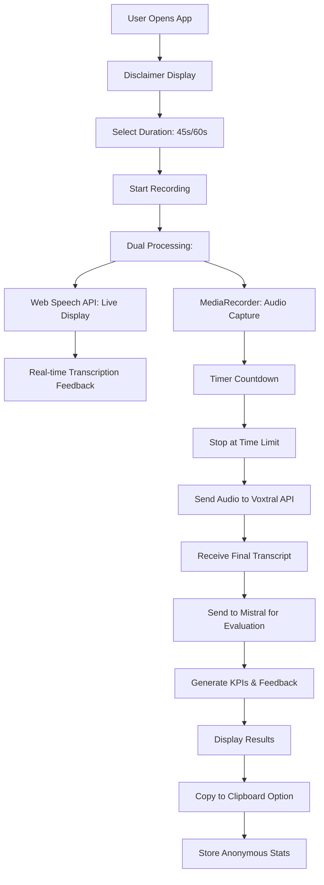

# PitchTrainer Architecture

## Overview
A web-based BNI pitch training application with German speech recognition, real-time evaluation, and AI-powered feedback using Mistral models. Deployed at pitrain.waffelwurst.de via automated CI/CD pipeline.

## User Story & Requirements

**Goal**: Train BNI Members for their weekly 45s and 60s pitch presentations with real-time feedback and actionable improvement recommendations.

### Requirements
- **Fast Performance**: < 200ms speech recognition feedback and < 5s evaluation response
- **Self-Explanatory Interface**: Completely intuitive, no training required
- **Dual Duration Support**: Only two choices - 45s and 60s pitch durations
- **Quick Evaluation**: Assessment and recommendations available in < 5s
- **Simple Export**: Copy to clipboard as only data export option
- **Legal Disclaimer**: "Keine Gewähr für Funktion oder Datenschutz. Nutzung auf eigenes Risiko." prominently displayed
- **Modern Mobile UX**: Fresh styling, mobile-optimized, touch-friendly interface

### Constraints
- **Mistral Models Only**: Use Voxtral-mini-2507 for transcription, Mistral-7B for evaluation
- **Privacy First**: Store evaluation results and proposal types without user tracking
- **Statistical Analysis**: Anonymous data collection for improvement pattern analysis
- **Existing Infrastructure**: Deploy via GitHub Actions to pitrain.waffelwurst.de using MultiServer setup
- **German Focus**: Optimized for German BNI presentations with automatic language detection

## Technology Stack

### Frontend
- **Framework**: React 18 with TypeScript
- **Styling**: TailwindCSS (mobile-first, responsive)
- **Live Transcription**: Web Speech API for real-time display
- **Audio Recording**: MediaRecorder API for high-quality capture
- **State Management**: Zustand (lightweight, simple)
- **UI Components**: Shadcn/ui (modern, accessible)

### Backend
- **Runtime**: Node.js with Express
- **Database**: SQLite (simple, file-based for statistics)
- **Speech-to-Text**: Voxtral-mini-2507 via Mistral Audio API
- **LLM Integration**: Mistral AI API for evaluation
- **Container**: Docker with Alpine Linux base image

### Infrastructure
- **Deployment**: Docker container via GitHub Actions
- **Proxy**: NGINX reverse proxy (MultiServer infrastructure)
- **Network**: waffelwurst_frontend Docker network
- **SSL**: Wildcard certificate for *.waffelwurst.de

### AI Models
- **Hybrid Speech Recognition**:
  - Web Speech API: Real-time display for user feedback
  - Voxtral-mini-2507: Accurate final transcription for evaluation ($0.001/minute)
- **Mistral-7B-Instruct-v0.3**: Pitch evaluation and feedback generation
- **Benefits**: Best of both worlds - live feedback + accurate transcription

## Architecture Components

### 1. Hybrid Speech Recognition Module
```
Browser Microphone → Dual Processing:
├─ Web Speech API → Real-time Display (immediate feedback)
└─ MediaRecorder → Audio Buffer → Voxtral API → Final Transcript
```
- **Live Display**: Web Speech API shows words as spoken (< 50ms latency)
- **Accurate Capture**: MediaRecorder saves high-quality audio (WebM/Opus)
- **Final Transcription**: Voxtral-mini-2507 provides precise German transcription for evaluation
- **User Experience**: Users see immediate feedback, system uses accurate transcript
- **Fallback**: If Web Speech fails, show recording animation until Voxtral responds

### 2. Timer Module
```
User Selection (45s/60s) → Visual Countdown → Audio Cues → Auto-stop Recording
```
- Visual progress bar with color coding (green → yellow → red)
- Audio beeps at 10s, 5s remaining
- Automatic recording stop at time limit

### 3. Evaluation Engine
```
Transcribed Text → Mistral API → Structured Analysis → KPI Scores
```

**Simplified KPI Categories (Text-Analyzable):**
- **Call-to-Action Quality** (40% weight - MOST IMPORTANT):
  - Specific referral ask present (0-100)
  - Contact method clarity (0-100)
  - Target client definition (0-100)
  - Actionable request (0-100)

- **Structure & Time** (25% weight):
  - Introduction completeness (0-100)
  - Word count optimization (0-100)
  - Clear flow/organization (0-100)
  - Time management (0-100)

- **Content Clarity** (20% weight):
  - Jargon-free language (0-100)
  - Single focus maintenance (0-100)
  - Benefit articulation (0-100)
  - Credibility markers (0-100)

- **Memorability** (15% weight):
  - Hook/tagline presence (0-100)
  - Unique element (0-100)
  - Concrete examples (0-100)

### 4. Feedback Generator
```
KPI Scores + Transcript → Mistral API → Improvement Proposals
```

**Focused Improvement Categories:**
- `CTA_SPECIFICITY`: Make your referral ask more specific
- `CTA_CLARITY`: Tell people exactly how to help you
- `STRUCTURE_BASICS`: Add missing intro/outro elements
- `SIMPLIFY_MESSAGE`: Remove jargon, focus on one service
- `ADD_MEMORY_HOOK`: Create a memorable tagline or slogan
- `TIME_OPTIMIZATION`: Adjust content length for time limit

### 5. Data Persistence
```
SQLite Database Schema:
- evaluations: id, timestamp, duration, kpi_scores (JSON)
- proposals: id, eval_id, type, count
- statistics: aggregate_date, avg_scores, total_count
```
- No user tracking or personal data storage
- Anonymous statistical aggregation only

## System Flow



## API Endpoints

```
POST /api/transcribe
  Body: FormData with audio file (WebM/Opus)
  Response: { transcript: string, language: string, duration: number }

POST /api/evaluate
  Body: { transcript: string, duration: 45|60 }
  Response: { kpis: KPIScores, proposals: Proposal[] }

GET /api/statistics
  Response: { totalEvaluations: number, avgScores: KPIScores }
```

## CI/CD & Deployment Configuration

### Docker Configuration
```dockerfile
# Dockerfile
FROM node:18-alpine
WORKDIR /app
COPY package*.json ./
RUN npm ci --production
COPY . .
EXPOSE 3000
CMD ["node", "server.js"]
```

### Docker Compose Integration
```yaml
# docker-compose.yml addition for pitrain service
services:
  pitrain:
    build: ./pitrain
    container_name: pitrain_app
    ports:
      - "3000:3000"
    environment:
      - NODE_ENV=production
      - MISTRAL_API_KEY=${MISTRAL_API_KEY}
      - DATABASE_PATH=/data/pitrain.db
    volumes:
      - ./data:/data
    networks:
      - waffelwurst_frontend
    restart: unless-stopped
    healthcheck:
      test: ["CMD", "curl", "-f", "http://localhost:3000/health"]
      interval: 30s
      timeout: 10s
      retries: 3
```

### GitHub Actions Workflow
```yaml
# .github/workflows/deploy.yml
name: Deploy PitchTrainer to IONOS

on:
  push:
    branches: [main]
  workflow_dispatch:

jobs:
  test:
    runs-on: ubuntu-latest
    steps:
      - uses: actions/checkout@v3
      - uses: actions/setup-node@v3
        with:
          node-version: '18'
      - run: npm ci
      - run: npm test
      - run: npm run build

  deploy:
    needs: test
    runs-on: ubuntu-latest
    if: github.ref == 'refs/heads/main'
    steps:
      - uses: actions/checkout@v3
      
      - name: Deploy to IONOS Server
        env:
          SSH_PRIVATE_KEY: ${{ secrets.IONOS_SSH_PRIVATE_KEY }}
          SERVER_HOST: ${{ secrets.IONOS_SERVER_HOST }}
          SERVER_USER: ${{ secrets.IONOS_SSH_USER }}
        run: |
          mkdir -p ~/.ssh
          echo "$SSH_PRIVATE_KEY" > ~/.ssh/deploy_key
          chmod 600 ~/.ssh/deploy_key
          
          ssh -o StrictHostKeyChecking=no -i ~/.ssh/deploy_key \
            $SERVER_USER@$SERVER_HOST << 'EOF'
            cd ~/pitrain
            git pull origin main
            docker-compose build pitrain
            docker-compose up -d pitrain
            docker-compose exec nginx-proxy nginx -s reload
          EOF

  notify:
    needs: deploy
    runs-on: ubuntu-latest
    if: always()
    steps:
      - name: Check Deployment
        run: |
          curl -f https://pitrain.waffelwurst.de/health || exit 1
          echo "Deployment successful!"
```

### GitHub Secrets Required
```
IONOS_SSH_PRIVATE_KEY    # SSH private key for server access
IONOS_SERVER_HOST        # Server IP (217.154.9.145)
IONOS_SSH_USER          # SSH username (andreas)
MISTRAL_API_KEY         # Mistral AI API key
```

### Environment Variables
```bash
# .env.production
MISTRAL_API_KEY=<your-mistral-api-key>
DATABASE_PATH=/data/pitrain.db
PORT=3000
NODE_ENV=production
ALLOWED_ORIGINS=https://pitrain.waffelwurst.de
```

### NGINX Configuration (Already in MultiServer)
The NGINX configuration is already set up in MultiServer at:
`/nginx/sites-enabled/20-pitrain.conf`

When deploying, uncomment the proxy_pass sections in the NGINX config:
```nginx
location /api/ {
    proxy_pass http://pitrain:3000/api/;
    # ... rest of config
}
```

## Performance Requirements
- **Live transcription**: < 50ms latency (Web Speech API)
- **Final transcription**: < 200ms latency (Voxtral-mini-2507)
- **Evaluation response**: < 5s total (end-to-end)
- **Mobile-optimized**: < 2MB bundle size
- **Lighthouse score**: > 90 performance
- **Audio file size**: Max 10MB (45-60s recording)
- **Browser compatibility**: Chrome, Safari, Firefox, Edge (Web Speech API)

## Security & Privacy
- No user authentication required
- No personal data collection
- HTTPS-only deployment
- Content Security Policy headers
- Rate limiting on API endpoints

## UI/UX Design Principles
- Single-page application
- Self-explanatory interface
- Large, touch-friendly buttons
- High contrast for accessibility
- Progressive enhancement approach

## User Interface Mockup

### Initial Screen
```
╔═══════════════════════════════════════╗
║           🎯 PitchTrainer             ║
╠═══════════════════════════════════════╣
║                                       ║
║  ⚠️  Keine Gewähr für Funktion oder   ║
║      Datenschutz. Nutzung auf         ║
║      eigenes Risiko.                  ║
║                                       ║
║ ┌─────────────────────────────────────┐ ║
║ │    Wähle deine Pitch-Dauer:        │ ║
║ │                                     │ ║
║ │  ┏━━━━━━━━━━━┓  ┏━━━━━━━━━━━━━━━━━━┓ │ ║
║ │  ┃   45s    ┃  ┃      60s       ┃ │ ║
║ │  ┃   BNI    ┃  ┃   Elevator     ┃ │ ║
║ │  ┗━━━━━━━━━━━┛  ┗━━━━━━━━━━━━━━━━━━┛ │ ║
║ └─────────────────────────────────────┘ ║
║                                       ║
╚═══════════════════════════════════════╝
```

### Recording Screen
```
╔═══════════════════════════════════════╗
║           🎯 PitchTrainer             ║
╠═══════════════════────────────────────╣
║                                       ║
║        🔴 AUFNAHME - 60s Pitch        ║
║                                       ║
║  ┌─────────────────────────────────┐   ║
║  │ ████████████░░░░░░░░░░░░░░░░░░░░ │   ║
║  │         42s verbleibend         │   ║
║  └─────────────────────────────────┘   ║
║                                       ║
║ ┌─────────────────────────────────────┐ ║
║ │ 📝 Live Transcript:                 │ ║
║ │                                     │ ║
║ │ Hallo, mein Name ist Andreas und    │ ║
║ │ ich bin Geschäftsführer der         │ ║
║ │ Sigloch Consulting. Wir helfen      │ ║
║ │ Unternehmen dabei...                │ ║
║ │                                     │ ║
║ └─────────────────────────────────────┘ ║
║                                       ║
║      ┏━━━━━━━━━━━━━━━━━━━━━━━━━━━┓      ║
║      ┃        STOPP 🛑         ┃      ║
║      ┗━━━━━━━━━━━━━━━━━━━━━━━━━━━┛      ║
║                                       ║
╚═══════════════════════════════════════╝
```

### Results Screen
```
╔═══════════════════════════════════════╗
║           🎯 PitchTrainer             ║
╠═══════════════════════════════════════╣
║                                       ║
║  ✅ Pitch Analysis - 60s Complete     ║
║                                       ║
║ ┌─────────────────────────────────────┐ ║
║ │ 📊 Bewertung:                       │ ║
║ │                                     │ ║
║ │ Call-to-Action    ████████░░  85/100│ ║
║ │ Struktur & Zeit   ██████░░░░  65/100│ ║
║ │ Klarheit         ███████░░░  70/100│ ║
║ │ Merkbarkeit      █████░░░░░  50/100│ ║
║ │                                     │ ║
║ │ 🎯 Gesamtscore: 68/100              │ ║
║ └─────────────────────────────────────┘ ║
║                                       ║
║ ┌─────────────────────────────────────┐ ║
║ │ 💡 Verbesserungsvorschläge:         │ ║
║ │                                     │ ║
║ │ • CTA_SPECIFICITY: Konkretere       │ ║
║ │   Empfehlungsanfrage formulieren    │ ║
║ │                                     │ ║
║ │ • ADD_MEMORY_HOOK: Einprägsamen     │ ║
║ │   Slogan hinzufügen                 │ ║
║ │                                     │ ║
║ └─────────────────────────────────────┘ ║
║                                       ║
║ ┏━━━━━━━━━━━━━━━━━━┓ ┏━━━━━━━━━━━━━━━━━┓ ║
║ ┃ 📋 KOPIEREN     ┃ ┃ 🔄 NOCHMAL     ┃ ║
║ ┗━━━━━━━━━━━━━━━━━━┛ ┗━━━━━━━━━━━━━━━━━┛ ║
║                                       ║
╚═══════════════════════════════════════╝
```

### Mobile Responsive Notes
- Touch targets minimum 44px height
- Progress bar adapts to screen width
- Transcript area scrollable on small screens
- Buttons stack vertically on mobile
- Large, clear typography (16px minimum)

## Development Phases

### Phase 1: MVP
- Hybrid speech recognition (Web Speech + MediaRecorder)
- Voxtral-mini-2507 transcription integration
- Simple timer implementation (45s/60s)
- Mistral-7B evaluation with simplified KPIs
- Real-time transcript display during recording
- Copy to clipboard functionality

### Phase 2: Enhancement
- Statistical dashboard
- Improved feedback algorithms
- Offline capability with PWA
- Multi-language support preparation

### Phase 3: Advanced
- Voice coaching tips
- Practice history (local storage)
- Export statistics reports
- A/B testing for feedback quality

## Testing Strategy

### 3-Level Testing Approach

#### Level 1: Unit Testing (< 5 seconds, no external dependencies)
**Purpose**: Individual functions, fast feedback loop during development

**Components**:
- `TimerService.calculateProgress()` - Progress bar calculations
- `EvaluationEngine.calculateKPIScores()` - KPI computation logic
- `FeedbackGenerator.generateProposals()` - Improvement suggestion algorithms
- `SpeechRecognitionService.processAudioBuffer()` - Audio processing utilities
- React component rendering and props validation
- KPI validation and boundary checking functions
- Clipboard utility functions

#### Level 2: Integration Testing (30-120 seconds, controlled test data)
**Purpose**: Components working together with test infrastructure

**Components**:
- `DatabaseService` with in-memory SQLite for data persistence testing
- React component interactions (duration selection → timer → recording flow)
- API endpoint responses with mocked Mistral API calls
- Frontend-backend communication via Supertest
- Audio recording → transcription pipeline with test audio files
- Mobile responsive design validation
- Copy to clipboard functionality across browsers

#### Level 3: System Validation (2-10 minutes, real APIs + database)
**Purpose**: Real conditions verification before deployment

**Components**:
- **Performance requirements**: Real Mistral API calls with < 200ms transcription, < 5s evaluation timing
- **Speech recognition accuracy**: German audio samples with real Voxtral-mini-2507 API
- **End-to-end user flows**: Complete pitch recording → evaluation → results → clipboard export
- **Database persistence**: Real SQLite file operations with anonymous statistics storage
- **Privacy compliance**: Verify no user tracking data is stored
- **Deployment health checks**: Live endpoint validation at pitrain.waffelwurst.de
- **Mobile device performance**: Real device testing with touch interactions

### Test Execution Strategy

```bash
# Fast feedback loop (development)
npm run test:unit          # Level 1: < 5s, runs on every save

# Feature validation (pre-commit) 
npm run test:integration   # Level 2: ~60s, validates component integration

# Pre-deployment validation
npm run test:system        # Level 3: ~5 minutes, full end-to-end verification
```

### Performance Test Requirements Matrix

| Component | Level 1 (Mock) | Level 2 (Test Environment) | Level 3 (Production APIs) |
|-----------|----------------|---------------------------|--------------------------|
| **Speech Recognition** | Mock response validation | Test German audio files | Real user audio samples |
| **Evaluation Engine** | Static transcript processing | Generated pitch samples | Live user recordings |
| **Database Operations** | Mock function responses | In-memory SQLite testing | File-based SQLite persistence |
| **API Endpoints** | Unit test route handlers | Supertest HTTP requests | Live API calls with timing |
| **Mobile Responsiveness** | Component render tests | Viewport simulation | Real device validation |

### Key Test Scenarios by Requirement

#### REQ-1: Performance (< 200ms speech recognition, < 5s evaluation)
```javascript
// Level 3: System Validation
test('performance_requirements_met', async () => {
  const audioFile = await loadGermanAudioSample(45);
  
  // Test speech recognition speed
  const transcribeStart = performance.now();
  const transcript = await apiClient.transcribe(audioFile);
  const transcribeTime = performance.now() - transcribeStart;
  expect(transcribeTime).toBeLessThan(200);
  
  // Test evaluation speed
  const evalStart = performance.now();
  const evaluation = await apiClient.evaluate(transcript, 45);
  const evalTime = performance.now() - evalStart;
  expect(evalTime).toBeLessThan(5000);
});
```

#### REQ-2: Privacy (No user tracking, anonymous statistics only)
```javascript
// Level 3: System Validation
test('privacy_compliance_verified', async () => {
  await submitTestPitch();
  
  const dbRecords = await database.query('SELECT * FROM evaluations');
  dbRecords.forEach(record => {
    expect(record).not.toHaveProperty('userId');
    expect(record).not.toHaveProperty('ipAddress');
    expect(record).not.toHaveProperty('sessionId');
    expect(record.transcript).toBeUndefined(); // No transcript storage
  });
});
```

#### REQ-3: Mobile UX (Touch-friendly, responsive)
```javascript
// Level 2: Integration Test
test('mobile_usability_requirements', () => {
  simulateMobileViewport(375, 667);
  render(<App />);
  
  // Verify touch targets >= 44px
  const buttons = screen.getAllByRole('button');
  buttons.forEach(button => {
    expect(button.getBoundingClientRect().height).toBeGreaterThanOrEqual(44);
  });
  
  // Verify readable text >= 16px
  const textElements = screen.getAllByText(/./);
  textElements.forEach(element => {
    const fontSize = parseInt(getComputedStyle(element).fontSize);
    expect(fontSize).toBeGreaterThanOrEqual(16);
  });
});
```

### Continuous Integration Pipeline

```yaml
# .github/workflows/test.yml
name: Test Pipeline

on: [push, pull_request]

jobs:
  unit-tests:
    runs-on: ubuntu-latest
    steps:
      - uses: actions/checkout@v3
      - run: npm ci
      - run: npm run test:unit
      
  integration-tests:
    needs: unit-tests
    runs-on: ubuntu-latest
    steps:
      - uses: actions/checkout@v3
      - run: npm ci
      - run: npm run test:integration
      
  system-validation:
    needs: integration-tests
    runs-on: ubuntu-latest
    if: github.ref == 'refs/heads/main'
    steps:
      - uses: actions/checkout@v3
      - run: npm ci
      - run: npm run test:system
        env:
          MISTRAL_API_KEY: ${{ secrets.MISTRAL_API_KEY }}
```

This testing strategy ensures quality at every level while maintaining fast feedback loops for developers and comprehensive validation before deployment.